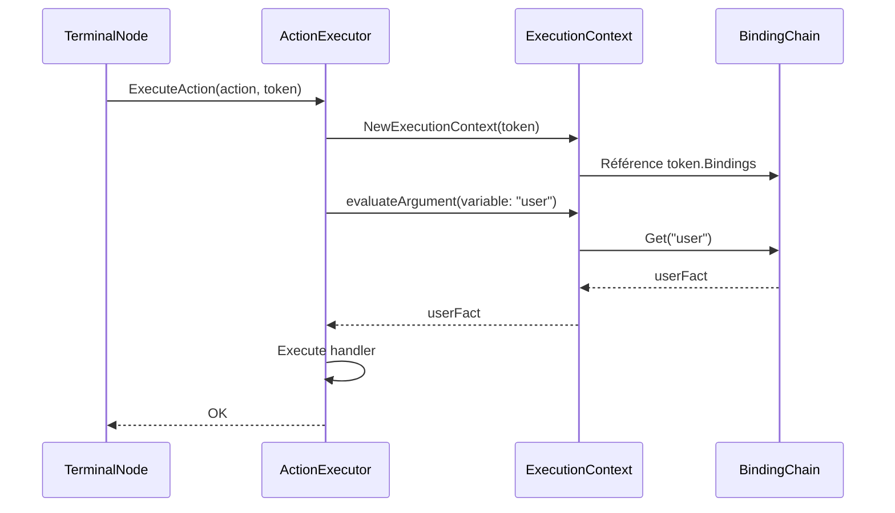

# 📋 TODO - Actions pour Améliorer l'Exécution des Actions

**Généré le** : 2025-12-12  
**Contexte** : Refactoring Prompt 08 - ExecutionContext et Actions  
**Statut** : Optionnel - Le code est fonctionnel et conforme

---

## ✅ Complété

- [✅] ExecutionContext utilise BindingChain
- [✅] Résolution de variables via BindingChain
- [✅] Messages d'erreur détaillés avec liste des variables
- [✅] TerminalNode propage correctement les bindings
- [✅] Documentation GoDoc complète
- [✅] Tests de qualité ajoutés
- [✅] Conformité standards (common.md + review.md)

---

## 🔮 Améliorations Futures (Optionnelles)

### 1. Performance : Cache O(1) pour BindingChain.Get()

**Contexte** :
Actuellement, `BindingChain.Get(variable)` parcourt la chaîne en O(n).
Pour n < 10 variables (cas typique), c'est acceptable.

**Opportunité d'optimisation** :
Si le profiling montre que `Get()` est un hotspot, ajouter un cache.

**Implémentation suggérée** :
```go
type BindingChain struct {
    Variable string
    Fact     *Fact
    Parent   *BindingChain
    
    // Cache optionnel (lazy initialization)
    cache map[string]*Fact  // nil par défaut
}

func (bc *BindingChain) Get(variable string) *Fact {
    // Si cache existe, utiliser O(1)
    if bc.cache != nil {
        return bc.cache[variable]
    }
    
    // Sinon, parcours O(n) comme actuellement
    current := bc
    for current != nil {
        if current.Variable == variable {
            return current.Fact
        }
        current = current.Parent
    }
    return nil
}

// buildCache construit le cache si nécessaire
func (bc *BindingChain) buildCache() {
    if bc.cache != nil {
        return  // Déjà construit
    }
    
    bc.cache = make(map[string]*Fact)
    vars := bc.Variables()
    for _, v := range vars {
        // Parcours une fois pour construire
        current := bc
        for current != nil {
            if current.Variable == v {
                bc.cache[v] = current.Fact
                break
            }
            current = current.Parent
        }
    }
}
```

**Quand optimiser** :
- ⚠️ Uniquement si profiling montre un besoin
- ⚠️ Pas d'optimisation prématurée
- ⚠️ Mesurer avant/après avec benchmarks

**TODO** :
```
TODO: [PERFORMANCE] Si profiling révèle que BindingChain.Get() est un hotspot,
      implémenter un cache lazy O(1) pour accès répétés aux variables.
      Actuellement O(n) acceptable pour n < 10 (cas typique).
      
      Fichier : rete/binding_chain.go
      Fonction : BindingChain.Get()
      
      Benchmark avant optimisation :
      go test -bench=BenchmarkBindingChain_Get -benchmem
```

---

### 2. Documentation : Diagrammes de Séquence

**Contexte** :
La documentation texte est complète, mais des diagrammes aideraient à visualiser le flow.

**Opportunité** :
Ajouter des diagrammes pour :
1. Flow d'exécution d'une action (Token → ExecutionContext → ActionExecutor → Handler)
2. Résolution de variable via BindingChain
3. Propagation des bindings (AlphaNode → BetaNode → TerminalNode)

**Outils suggérés** :
- PlantUML pour génération de diagrammes à partir de texte
- Mermaid (compatible GitHub Markdown)

**Exemple avec Mermaid** :


**TODO** :
```
TODO: [DOCUMENTATION] Ajouter des diagrammes de séquence pour visualiser :
      1. Flow d'exécution des actions
      2. Résolution de variables via BindingChain
      3. Propagation des bindings dans le réseau RETE
      
      Fichiers à créer :
      - docs/architecture/action_execution_flow.md
      - docs/architecture/binding_chain_resolution.md
      
      Format : Mermaid (compatible GitHub)
```

---

### 3. Tests de Charge : N Variables

**Contexte** :
Actuellement testé avec jusqu'à 3 variables.
Le système devrait fonctionner avec plus, mais non validé.

**Opportunité** :
Créer des tests de charge pour valider :
- Performance avec 10-20 variables
- Mémoire utilisée avec N variables
- Temps d'accès O(n) reste acceptable

**Implémentation suggérée** :
```go
// TestActionExecutor_ManyVariables_Performance teste la performance avec N variables
func TestActionExecutor_ManyVariables_Performance(t *testing.T) {
    variableCounts := []int{5, 10, 20, 50}
    
    for _, n := range variableCounts {
        t.Run(fmt.Sprintf("%d_variables", n), func(t *testing.T) {
            // Créer n faits
            facts := make([]*Fact, n)
            bindings := NewBindingChain()
            
            for i := 0; i < n; i++ {
                facts[i] = &Fact{
                    ID: fmt.Sprintf("f%d", i),
                    Type: "TestFact",
                    Fields: map[string]interface{}{
                        "value": i,
                    },
                }
                bindings = bindings.Add(fmt.Sprintf("var%d", i), facts[i])
            }
            
            token := &Token{
                ID: "test",
                Facts: facts,
                Bindings: bindings,
            }
            
            // Mesurer temps d'accès
            start := time.Now()
            for i := 0; i < n; i++ {
                fact := token.Bindings.Get(fmt.Sprintf("var%d", i))
                require.NotNil(t, fact)
            }
            duration := time.Since(start)
            
            // Validation : O(n²) devrait rester < 1ms pour n=50
            maxDuration := time.Millisecond
            if duration > maxDuration {
                t.Errorf("Accès à %d variables trop lent: %v (max: %v)", 
                    n, duration, maxDuration)
            }
            
            t.Logf("✅ %d variables : %v", n, duration)
        })
    }
}
```

**TODO** :
```
TODO: [TESTS] Créer des tests de charge pour valider performance avec N variables.
      
      Fichier : rete/binding_chain_performance_test.go
      
      Tests à ajouter :
      - TestBindingChain_AccessPerformance (5, 10, 20, 50 variables)
      - TestActionExecutor_ManyVariables_Performance
      - BenchmarkBindingChain_Get_N_Variables
      
      Critères de succès :
      - n=10 : < 100µs total
      - n=20 : < 500µs total
      - n=50 : < 1ms total
```

---

### 4. Optimisation : Réutilisation ExecutionContext

**Contexte** :
Actuellement, un nouveau ExecutionContext est créé pour chaque action.
Pour des faits identiques, on pourrait réutiliser le contexte.

**Opportunité** :
Si profiling montre que la création de contexte est coûteuse, implémenter un pool.

**Implémentation suggérée** :
```go
// ExecutionContextPool gère un pool de contextes réutilisables
type ExecutionContextPool struct {
    pool sync.Pool
}

func NewExecutionContextPool() *ExecutionContextPool {
    return &ExecutionContextPool{
        pool: sync.Pool{
            New: func() interface{} {
                return &ExecutionContext{}
            },
        },
    }
}

func (p *ExecutionContextPool) Get(token *Token, network *ReteNetwork) *ExecutionContext {
    ctx := p.pool.Get().(*ExecutionContext)
    ctx.token = token
    ctx.network = network
    ctx.bindings = token.Bindings
    return ctx
}

func (p *ExecutionContextPool) Put(ctx *ExecutionContext) {
    // Reset pour éviter fuites mémoire
    ctx.token = nil
    ctx.network = nil
    ctx.bindings = nil
    p.pool.Put(ctx)
}
```

**Quand optimiser** :
- ⚠️ Uniquement si création de contexte est hotspot
- ⚠️ Mesurer allocation avec `go test -benchmem`

**TODO** :
```
TODO: [PERFORMANCE] Si création ExecutionContext est hotspot, implémenter pool.
      
      Actuellement : Nouvelle allocation par action
      Optimisation : sync.Pool pour réutilisation
      
      Fichier : rete/action_executor_context.go
      
      Benchmark avant :
      go test -bench=BenchmarkExecutionContext_Creation -benchmem
      
      ⚠️ Pas prioritaire - optimisation prématurée probable
```

---

## 🚦 Priorités

| TODO | Priorité | Quand | Effort |
|------|----------|-------|--------|
| Cache BindingChain.Get() | 🟡 Basse | Si profiling le justifie | 2-3h |
| Diagrammes de séquence | 🟢 Moyenne | Avant intégration équipe | 1-2h |
| Tests de charge N variables | 🟢 Moyenne | Avant Prompt 10 | 1h |
| Pool ExecutionContext | 🟡 Basse | Si profiling le justifie | 2h |

**Légende** :
- 🔴 Haute : Bloquant ou critique
- 🟢 Moyenne : Améliore qualité/compréhension
- 🟡 Basse : Optimisation prématurée probable

---

## 📝 Notes

### Principe "YAGNI" (You Aren't Gonna Need It)

Les TODOs ci-dessus sont des **opportunités** d'optimisation, **pas des nécessités**.

**Règle d'or** :
1. ✅ Mesurer d'abord (profiling, benchmarks)
2. ❌ Ne pas optimiser prématurément
3. ✅ Garder le code simple tant que perf est acceptable

### Quand Agir sur ces TODOs

**Signaux pour optimiser** :
- ⚠️ Profiling montre que BindingChain.Get() est > 10% du temps CPU
- ⚠️ Benchmarks montrent que n > 50 variables ralentit significativement
- ⚠️ Tests de charge échouent

**Signaux pour documenter** :
- 📚 Nouveaux contributeurs ont du mal à comprendre le flow
- 📚 Questions répétées sur le fonctionnement
- 📚 Intégration avec autres composants complexe

---

## ✅ Validation Finale

**État actuel** : Code fonctionnel, conforme aux standards, testé

**Aucun TODO bloquant** : Le système fonctionne correctement tel quel

**TODOs optionnels** : À considérer si/quand le besoin se présente

---

**Document généré le** : 2025-12-12 18:45 UTC  
**Par** : AI Assistant  
**Révision** : Jamais (sauf si besoin prouvé)
