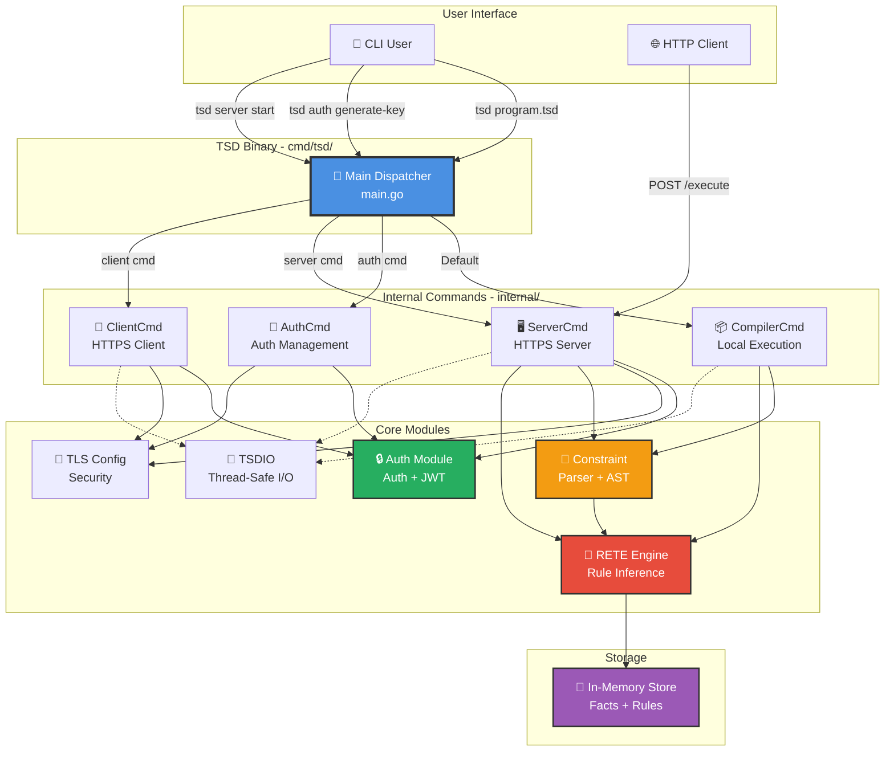
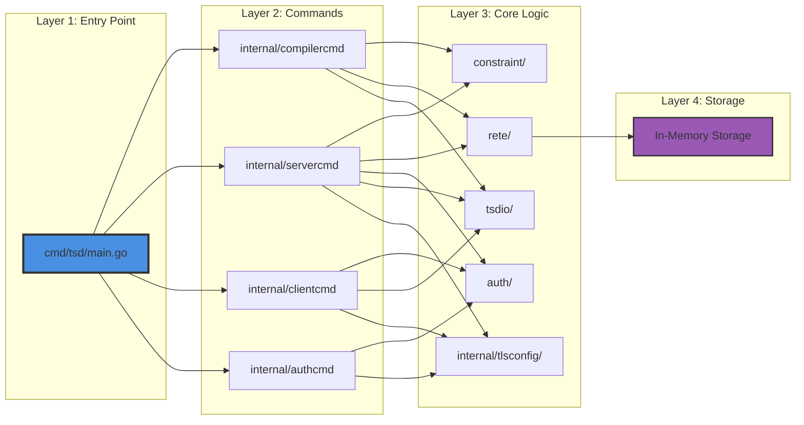
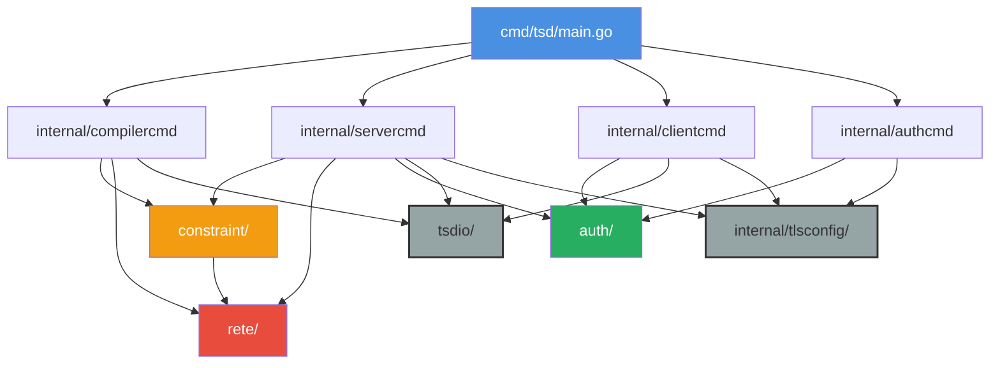

# 🏗️ Architecture Globale TSD

**Date** : 2025-12-16  
**Version** : 1.0.0  
**Statut** : Documentation officielle

---

## Vue d'Ensemble du Système

Ce diagramme présente l'architecture globale du système TSD avec ses modules principaux et leurs interactions.

---

## Architecture en Couches

---

## Graphe de Dépendances

Ce diagramme montre les dépendances entre modules (DAG - Directed Acyclic Graph).

**✅ Points clés :**
- Graphe **acyclique** (pas de cycles)
- Dépendances **unidirectionnelles**
- Modules indépendants : `auth/`, `tsdio/`, `internal/tlsconfig/`
- Réutilisabilité maximale

---

## Modules Principaux

### 1. cmd/tsd/ - Point d'Entrée Unique
- **Lignes** : ~177
- **Rôle** : Dispatcher intelligent multi-rôles
- **Responsabilité** : Router vers la commande appropriée

### 2. internal/compilercmd/ - Compilateur Local
- **Rôle** : Exécution locale de programmes TSD
- **Flux** : Fichier TSD → Parser → RETE → Résultats

### 3. internal/servercmd/ - Serveur HTTPS
- **Rôle** : Serveur HTTPS avec authentification
- **Endpoints** :
  - `POST /execute` : Exécuter programme TSD
  - `GET /health` : Health check
  - `GET /metrics` : Métriques Prometheus

### 4. internal/clientcmd/ - Client HTTPS
- **Rôle** : Client pour exécution distante
- **Fonctionnalités** : Envoie code TSD au serveur

### 5. internal/authcmd/ - Gestion Authentification
- **Rôle** : Génération clés, JWT, certificats TLS
- **Commandes** :
  - `generate-key` : Génère clé API
  - `generate-jwt` : Génère token JWT
  - `generate-certs` : Génère certificats TLS

### 6. constraint/ - Parser
- **Rôle** : Analyse syntaxique du langage TSD
- **Sortie** : AST (Abstract Syntax Tree)

### 7. rete/ - Moteur d'Inférence
- **Rôle** : Exécution des règles (algorithme RETE)
- **Optimisations** :
  - Alpha sharing
  - Beta sharing
  - Result caching
  - Token pooling

### 8. auth/ - Module Authentification
- **Lignes** : ~313
- **Types** : Auth Key, JWT
- **Indépendant** : Aucune dépendance interne

### 9. tsdio/ - I/O Thread-Safe
- **Lignes** : ~400
- **Rôle** : Logging sécurisé pour concurrence
- **Indépendant** : Aucune dépendance interne

### 10. internal/tlsconfig/ - Configuration TLS
- **Rôle** : Configuration TLS centralisée
- **Avantages** : Standards sécurité uniformes

---

## Métriques Architecture

| Métrique | Valeur |
|----------|--------|
| **Packages totaux** | 10 |
| **Lignes code production** | ~4540 |
| **Lignes code tests** | ~10534 |
| **Ratio tests/production** | 2.3:1 |
| **Couverture tests** | 81.3% |
| **Cycles de dépendances** | 0 |
| **Dépendances externes** | 5 |

---

## Références

- [Architecture Détaillée](../architecture.md)
- [Vue d'Ensemble Système](../SYSTEM_OVERVIEW.md)
- [Flux de Données](02-data-flow.md)
- [RETE Engine](03-rete-architecture.md)

---

**Maintenu par** : TSD Contributors  
**Dernière mise à jour** : 2025-12-16
