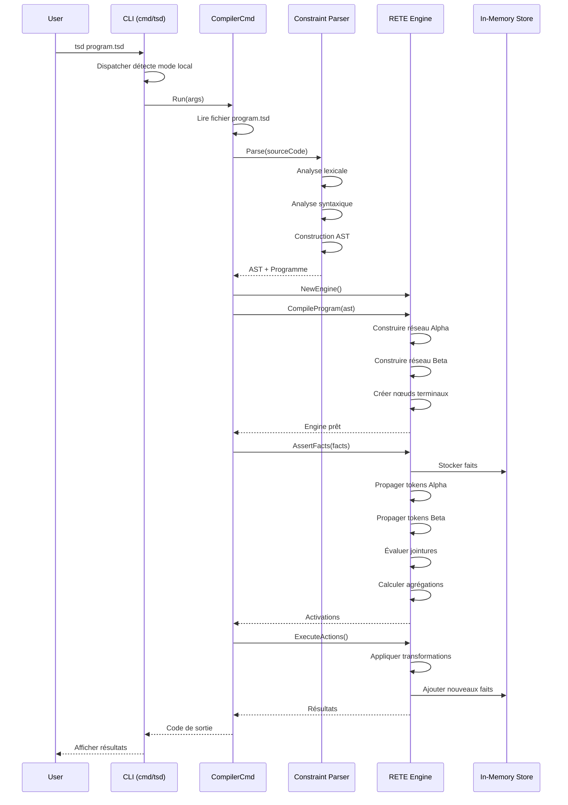
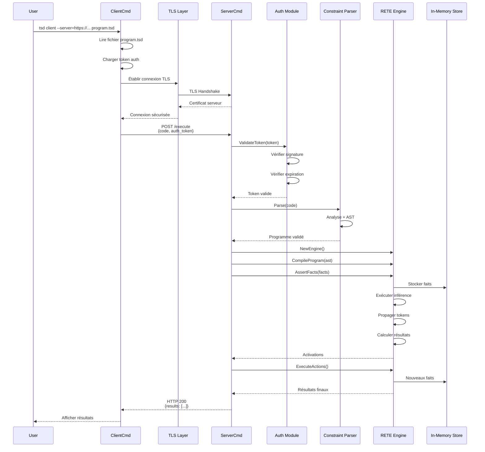
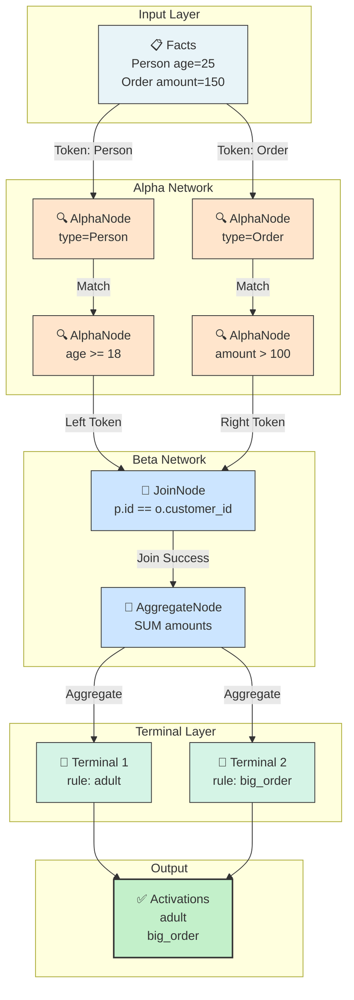
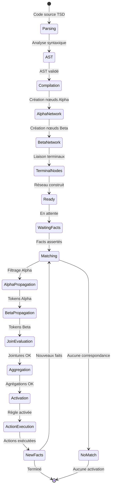
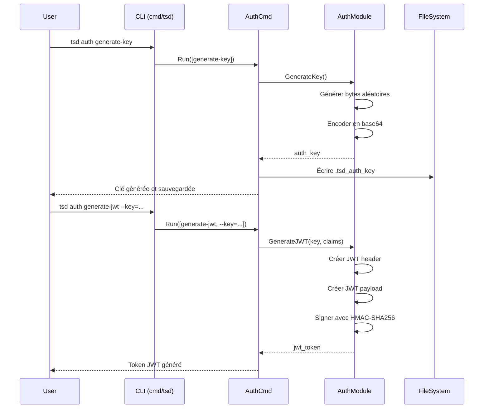
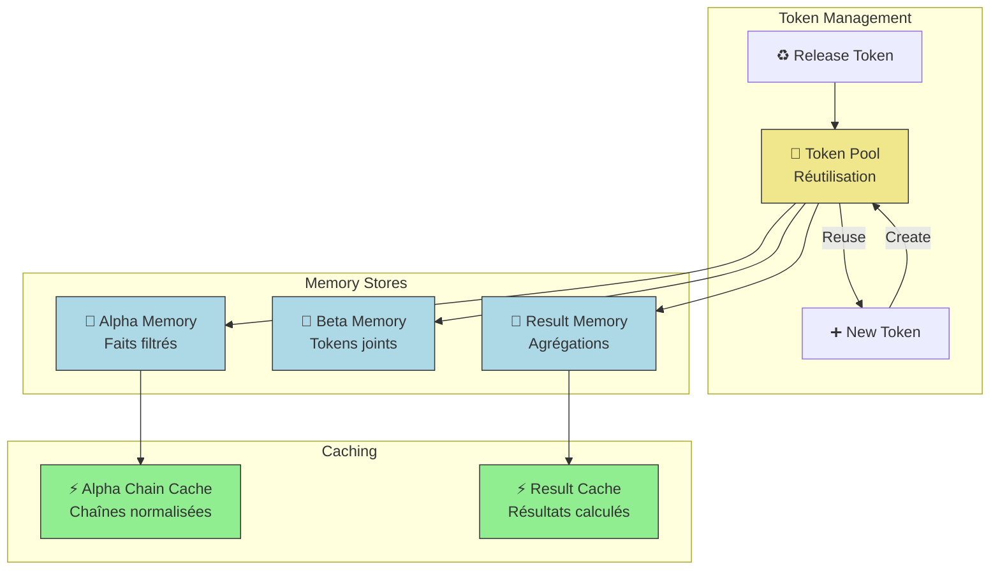
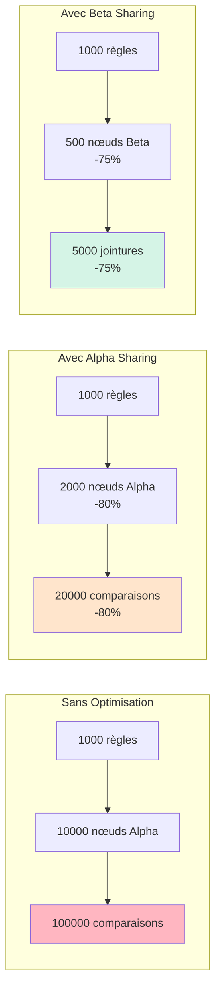

# 🔄 Flux de Données TSD

**Date** : 2025-12-16  
**Version** : 1.0.0  
**Statut** : Documentation officielle

---

## Flux d'Exécution Locale

Ce diagramme montre le flux complet d'une exécution locale de programme TSD.

---

## Flux Client-Serveur HTTPS

Ce diagramme montre le flux d'une exécution distante via HTTPS.

---

## Propagation des Tokens RETE

Ce diagramme montre comment les tokens se propagent dans le réseau RETE.

---

## Cycle de Vie d'une Règle

---

## Pipeline de Compilation

```mermaid
graph LR
    subgraph "Phase 1: Parsing"
        SRC[📄 Source Code]
        LEX[Lexer]
        PARSE[Parser]
        AST[📊 AST]
        
        SRC --> LEX
        LEX --> PARSE
        PARSE --> AST
    end

    subgraph "Phase 2: Validation"
        VAL[Type Checker]
        SEMANT[Semantic Analyzer]
        
        AST --> VAL
        VAL --> SEMANT
    end

    subgraph "Phase 3: Compilation"
        ALPHA[Alpha Network Builder]
        BETA[Beta Network Builder]
        TERM[Terminal Nodes Creator]
        
        SEMANT --> ALPHA
        ALPHA --> BETA
        BETA --> TERM
    end

    subgraph "Phase 4: Optimization"
        OPT1[Alpha Sharing]
        OPT2[Beta Sharing]
        OPT3[Node Normalization]
        
        TERM --> OPT1
        OPT1 --> OPT2
        OPT2 --> OPT3
    end

    subgraph "Output"
        ENGINE[🧠 RETE Engine<br/>Ready]
        
        OPT3 --> ENGINE
    end

    style SRC fill:#E8F4F8
    style AST fill:#FFE5CC
    style ENGINE fill:#D5F4E6,stroke:#333,stroke-width:3px
```

---

## Flux de Génération d'Authentification

---

## Gestion de la Mémoire RETE

---

## Performances et Optimisations

### Réduction de Complexité

---

## Références

- [Architecture Globale](01-global-architecture.md)
- [RETE Engine](03-rete-architecture.md)
- [Sécurité et Authentification](04-security-flow.md)

---

**Maintenu par** : TSD Contributors  
**Dernière mise à jour** : 2025-12-16
