# 🔄 Flux de Données TSD

**Date** : 2025-12-16  
**Version** : 1.0.0  
**Statut** : Documentation officielle

---

## Flux d'Exécution Locale

Ce diagramme montre le flux complet d'une exécution locale de programme TSD.

```mermaid
sequenceDiagram
    participant User
    participant CLI as CLI (cmd/tsd)
    participant Compiler as CompilerCmd
    participant Parser as Constraint Parser
    participant RETE as RETE Engine
    participant Memory as In-Memory Store

    User->>CLI: tsd program.tsd
    CLI->>CLI: Dispatcher détecte mode local
    CLI->>Compiler: Run(args)
    
    Compiler->>Compiler: Lire fichier program.tsd
    Compiler->>Parser: Parse(sourceCode)
    
    Parser->>Parser: Analyse lexicale
    Parser->>Parser: Analyse syntaxique
    Parser->>Parser: Construction AST
    Parser-->>Compiler: AST + Programme
    
    Compiler->>RETE: NewEngine()
    Compiler->>RETE: CompileProgram(ast)
    
    RETE->>RETE: Construire réseau Alpha
    RETE->>RETE: Construire réseau Beta
    RETE->>RETE: Créer nœuds terminaux
    RETE-->>Compiler: Engine prêt
    
    Compiler->>RETE: AssertFacts(facts)
    RETE->>Memory: Stocker faits
    RETE->>RETE: Propager tokens Alpha
    RETE->>RETE: Propager tokens Beta
    RETE->>RETE: Évaluer jointures
    RETE->>RETE: Calculer agrégations
    RETE-->>Compiler: Activations
    
    Compiler->>RETE: ExecuteActions()
    RETE->>RETE: Appliquer transformations
    RETE->>Memory: Ajouter nouveaux faits
    RETE-->>Compiler: Résultats
    
    Compiler-->>CLI: Code de sortie
    CLI-->>User: Afficher résultats
```

---

## Flux Client-Serveur HTTPS

Ce diagramme montre le flux d'une exécution distante via HTTPS.

```mermaid
sequenceDiagram
    participant User
    participant Client as ClientCmd
    participant TLS as TLS Layer
    participant Server as ServerCmd
    participant Auth as Auth Module
    participant Parser as Constraint Parser
    participant RETE as RETE Engine
    participant Memory as In-Memory Store

    User->>Client: tsd client --server=https://... program.tsd
    Client->>Client: Lire fichier program.tsd
    Client->>Client: Charger token auth
    
    Client->>TLS: Établir connexion TLS
    TLS->>Server: TLS Handshake
    Server-->>TLS: Certificat serveur
    TLS-->>Client: Connexion sécurisée
    
    Client->>Server: POST /execute<br/>{code, auth_token}
    
    Server->>Auth: ValidateToken(token)
    Auth->>Auth: Vérifier signature
    Auth->>Auth: Vérifier expiration
    Auth-->>Server: Token valide
    
    Server->>Parser: Parse(code)
    Parser->>Parser: Analyse + AST
    Parser-->>Server: Programme validé
    
    Server->>RETE: NewEngine()
    Server->>RETE: CompileProgram(ast)
    Server->>RETE: AssertFacts(facts)
    
    RETE->>Memory: Stocker faits
    RETE->>RETE: Exécuter inférence
    RETE->>RETE: Propager tokens
    RETE->>RETE: Calculer résultats
    RETE-->>Server: Activations
    
    Server->>RETE: ExecuteActions()
    RETE->>Memory: Nouveaux faits
    RETE-->>Server: Résultats finaux
    
    Server-->>Client: HTTP 200<br/>{results: [...]}
    Client-->>User: Afficher résultats
```

---

## Propagation des Tokens RETE

Ce diagramme montre comment les tokens se propagent dans le réseau RETE.

```mermaid
graph TB
    subgraph "Input Layer"
        FACTS[📋 Facts<br/>Person age=25<br/>Order amount=150]
    end

    subgraph "Alpha Network"
        A1[🔍 AlphaNode<br/>type=Person]
        A2[🔍 AlphaNode<br/>type=Order]
        A3[🔍 AlphaNode<br/>age >= 18]
        A4[🔍 AlphaNode<br/>amount > 100]
    end

    subgraph "Beta Network"
        B1[🔗 JoinNode<br/>p.id == o.customer_id]
        B2[🧮 AggregateNode<br/>SUM amounts]
    end

    subgraph "Terminal Layer"
        T1[🎯 Terminal 1<br/>rule: adult]
        T2[🎯 Terminal 2<br/>rule: big_order]
    end

    subgraph "Output"
        OUT[✅ Activations<br/>adult<br/>big_order]
    end

    FACTS -->|Token: Person| A1
    FACTS -->|Token: Order| A2
    
    A1 -->|Match| A3
    A2 -->|Match| A4
    
    A3 -->|Left Token| B1
    A4 -->|Right Token| B1
    
    B1 -->|Join Success| B2
    B2 -->|Aggregate| T1
    B2 -->|Aggregate| T2
    
    T1 --> OUT
    T2 --> OUT

    style FACTS fill:#E8F4F8,stroke:#333
    style A1 fill:#FFE5CC,stroke:#333
    style A2 fill:#FFE5CC,stroke:#333
    style A3 fill:#FFE5CC,stroke:#333
    style A4 fill:#FFE5CC,stroke:#333
    style B1 fill:#CCE5FF,stroke:#333
    style B2 fill:#CCE5FF,stroke:#333
    style T1 fill:#D5F4E6,stroke:#333
    style T2 fill:#D5F4E6,stroke:#333
    style OUT fill:#C3F0CA,stroke:#333,stroke-width:2px
```

---

## Cycle de Vie d'une Règle

```mermaid
stateDiagram-v2
    [*] --> Parsing: Code source TSD
    
    Parsing --> AST: Analyse syntaxique
    AST --> Compilation: AST validé
    
    Compilation --> AlphaNetwork: Création nœuds Alpha
    AlphaNetwork --> BetaNetwork: Création nœuds Beta
    BetaNetwork --> TerminalNodes: Liaison terminaux
    
    TerminalNodes --> Ready: Réseau construit
    
    Ready --> WaitingFacts: En attente
    WaitingFacts --> Matching: Facts assertés
    
    Matching --> AlphaPropagation: Filtrage Alpha
    AlphaPropagation --> BetaPropagation: Tokens Alpha
    BetaPropagation --> JoinEvaluation: Tokens Beta
    JoinEvaluation --> Aggregation: Jointures OK
    Aggregation --> Activation: Agrégations OK
    
    Activation --> ActionExecution: Règle activée
    ActionExecution --> NewFacts: Actions exécutées
    
    NewFacts --> Matching: Nouveaux faits
    NewFacts --> [*]: Terminé
    
    Matching --> NoMatch: Aucune correspondance
    NoMatch --> [*]: Aucune activation
```

---

## Pipeline de Compilation

```mermaid
graph LR
    subgraph "Phase 1: Parsing"
        SRC[📄 Source Code]
        LEX[Lexer]
        PARSE[Parser]
        AST[📊 AST]
        
        SRC --> LEX
        LEX --> PARSE
        PARSE --> AST
    end

    subgraph "Phase 2: Validation"
        VAL[Type Checker]
        SEMANT[Semantic Analyzer]
        
        AST --> VAL
        VAL --> SEMANT
    end

    subgraph "Phase 3: Compilation"
        ALPHA[Alpha Network Builder]
        BETA[Beta Network Builder]
        TERM[Terminal Nodes Creator]
        
        SEMANT --> ALPHA
        ALPHA --> BETA
        BETA --> TERM
    end

    subgraph "Phase 4: Optimization"
        OPT1[Alpha Sharing]
        OPT2[Beta Sharing]
        OPT3[Node Normalization]
        
        TERM --> OPT1
        OPT1 --> OPT2
        OPT2 --> OPT3
    end

    subgraph "Output"
        ENGINE[🧠 RETE Engine<br/>Ready]
        
        OPT3 --> ENGINE
    end

    style SRC fill:#E8F4F8
    style AST fill:#FFE5CC
    style ENGINE fill:#D5F4E6,stroke:#333,stroke-width:3px
```

---

## Flux de Génération d'Authentification

```mermaid
sequenceDiagram
    participant User
    participant CLI as CLI (cmd/tsd)
    participant AuthCmd
    participant AuthModule
    participant FileSystem

    User->>CLI: tsd auth generate-key
    CLI->>AuthCmd: Run([generate-key])
    
    AuthCmd->>AuthModule: GenerateKey()
    AuthModule->>AuthModule: Générer bytes aléatoires
    AuthModule->>AuthModule: Encoder en base64
    AuthModule-->>AuthCmd: auth_key
    
    AuthCmd->>FileSystem: Écrire .tsd_auth_key
    AuthCmd-->>User: Clé générée et sauvegardée
    
    User->>CLI: tsd auth generate-jwt --key=...
    CLI->>AuthCmd: Run([generate-jwt, --key=...])
    
    AuthCmd->>AuthModule: GenerateJWT(key, claims)
    AuthModule->>AuthModule: Créer JWT header
    AuthModule->>AuthModule: Créer JWT payload
    AuthModule->>AuthModule: Signer avec HMAC-SHA256
    AuthModule-->>AuthCmd: jwt_token
    
    AuthCmd-->>User: Token JWT généré
```

---

## Gestion de la Mémoire RETE

```mermaid
graph TB
    subgraph "Token Management"
        POOL[🔄 Token Pool<br/>Réutilisation]
        NEW[➕ New Token]
        RELEASE[♻️ Release Token]
        
        NEW -->|Create| POOL
        POOL -->|Reuse| NEW
        RELEASE --> POOL
    end

    subgraph "Memory Stores"
        ALPHA_MEM[💾 Alpha Memory<br/>Faits filtrés]
        BETA_MEM[💾 Beta Memory<br/>Tokens joints]
        RESULT_MEM[💾 Result Memory<br/>Agrégations]
    end

    subgraph "Caching"
        ALPHA_CACHE[⚡ Alpha Chain Cache<br/>Chaînes normalisées]
        RESULT_CACHE[⚡ Result Cache<br/>Résultats calculés]
    end

    POOL --> ALPHA_MEM
    POOL --> BETA_MEM
    POOL --> RESULT_MEM
    
    ALPHA_MEM --> ALPHA_CACHE
    RESULT_MEM --> RESULT_CACHE

    style POOL fill:#F0E68C,stroke:#333
    style ALPHA_MEM fill:#ADD8E6,stroke:#333
    style BETA_MEM fill:#ADD8E6,stroke:#333
    style RESULT_MEM fill:#ADD8E6,stroke:#333
    style ALPHA_CACHE fill:#90EE90,stroke:#333
    style RESULT_CACHE fill:#90EE90,stroke:#333
```

---

## Performances et Optimisations

### Réduction de Complexité

```mermaid
graph LR
    subgraph "Sans Optimisation"
        N1[1000 règles]
        N2[10000 nœuds Alpha]
        N3[100000 comparaisons]
    end

    subgraph "Avec Alpha Sharing"
        O1[1000 règles]
        O2[2000 nœuds Alpha<br/>-80%]
        O3[20000 comparaisons<br/>-80%]
    end

    subgraph "Avec Beta Sharing"
        P1[1000 règles]
        P2[500 nœuds Beta<br/>-75%]
        P3[5000 jointures<br/>-75%]
    end

    N1 --> N2
    N2 --> N3
    
    O1 --> O2
    O2 --> O3
    
    P1 --> P2
    P2 --> P3

    style N3 fill:#FFB6C1
    style O3 fill:#FFE5CC
    style P3 fill:#D5F4E6
```

---

## Références

- [Architecture Globale](01-global-architecture.md)
- [RETE Engine](03-rete-architecture.md)
- [Sécurité et Authentification](04-security-flow.md)

---

**Maintenu par** : TSD Contributors  
**Dernière mise à jour** : 2025-12-16
