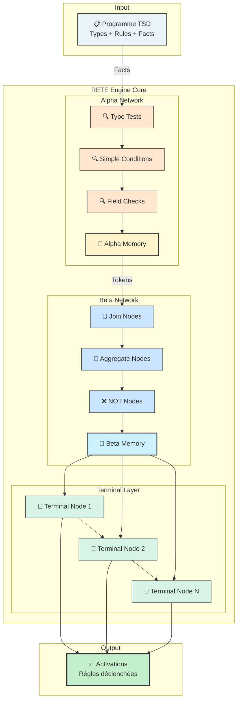
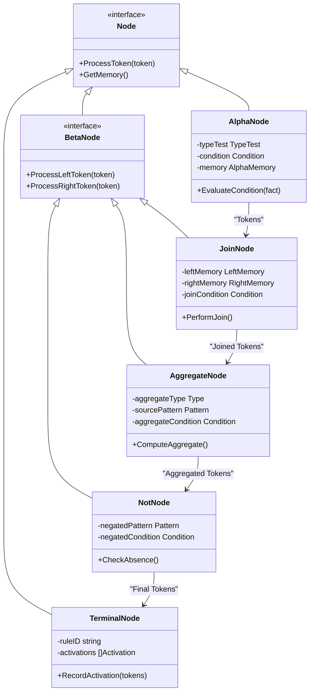
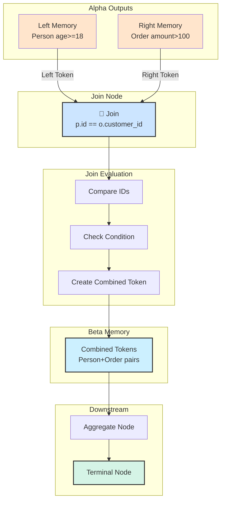
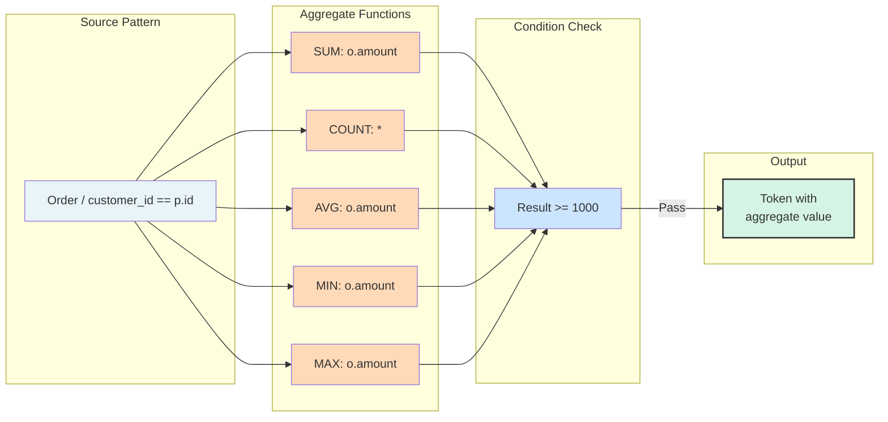
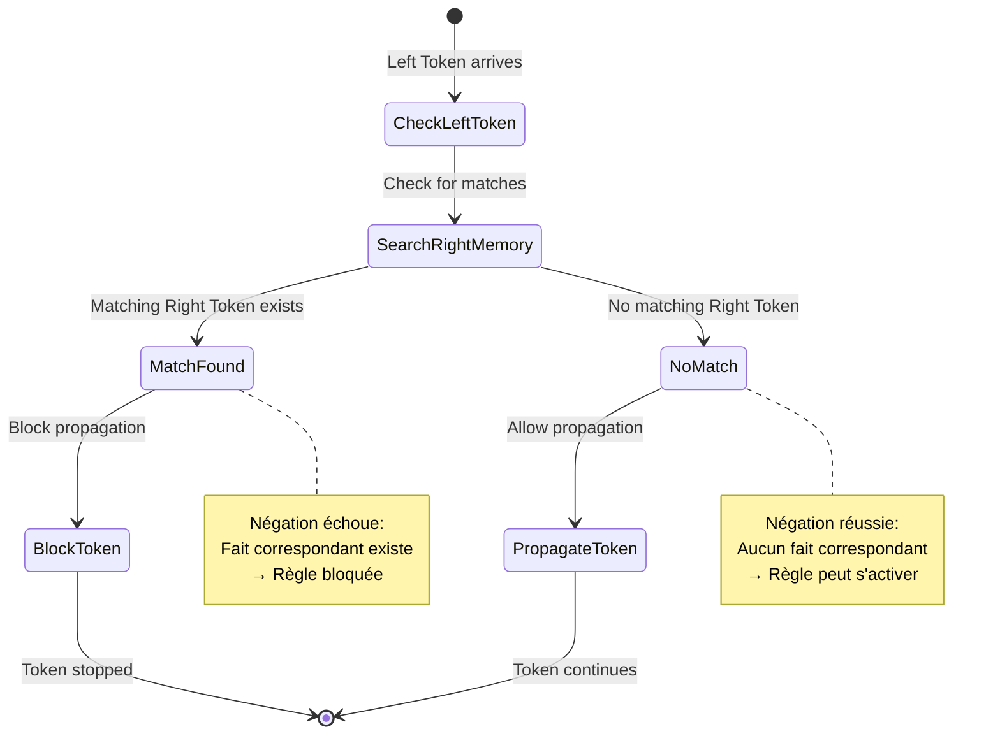
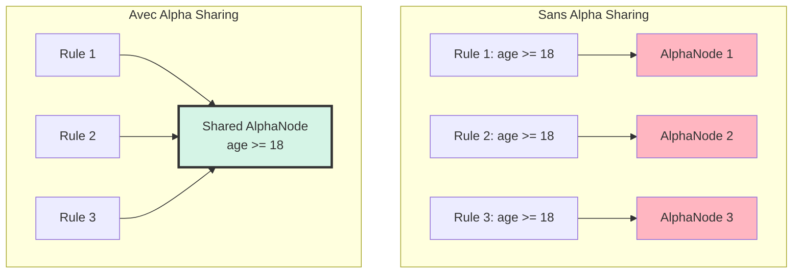
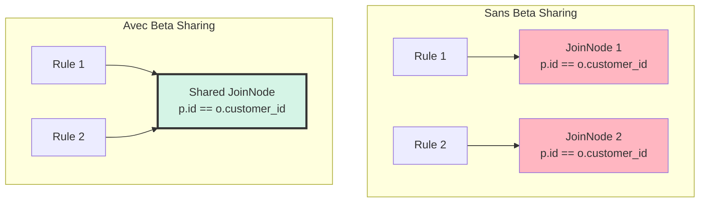
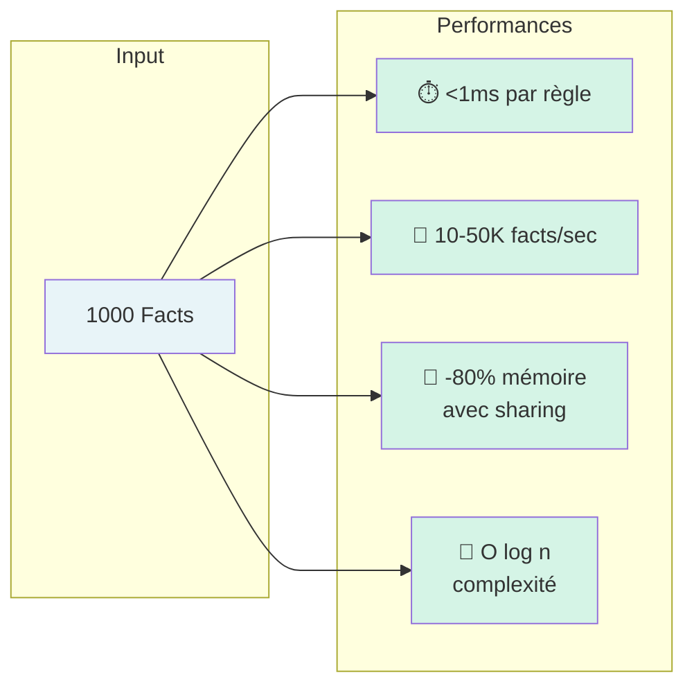
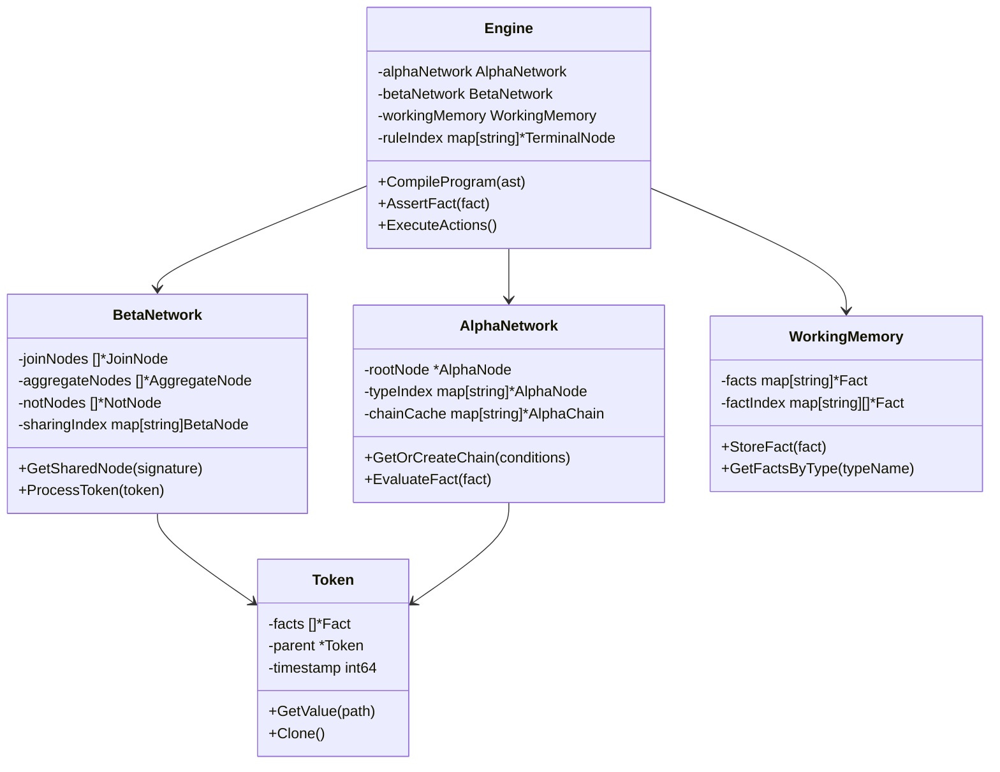

# 🧠 Architecture Moteur RETE

**Date** : 2025-12-16  
**Version** : 1.0.0  
**Statut** : Documentation officielle

---

## Vue d'Ensemble du Moteur RETE

Le moteur RETE (Rete Algorithm) est au cœur de TSD. Il permet l'évaluation efficace de règles complexes.



---

## Types de Nœuds RETE



---

## Réseau Alpha - Filtrage des Faits

```mermaid
graph TB
    subgraph "Input Facts"
        F1[Person{id:1, age:25}]
        F2[Person{id:2, age:17}]
        F3[Order{id:1, amount:150}]
        F4[Order{id:2, amount:50}]
    end

    subgraph "Type Filter Layer"
        TP[Type=Person]
        TO[Type=Order]
    end

    subgraph "Condition Filter Layer"
        C1[age >= 18]
        C2[age < 18]
        C3[amount > 100]
        C4[amount <= 100]
    end

    subgraph "Alpha Memory"
        M1[Person age>=18<br/>✓ id:1]
        M2[Person age<18<br/>✓ id:2]
        M3[Order amount>100<br/>✓ id:1]
        M4[Order amount<=100<br/>✓ id:2]
    end

    F1 --> TP
    F2 --> TP
    F3 --> TO
    F4 --> TO

    TP --> C1
    TP --> C2
    TO --> C3
    TO --> C4

    C1 -->|Match| M1
    C2 -->|Match| M2
    C3 -->|Match| M3
    C4 -->|Match| M4

    style F1 fill:#E8F4F8
    style F2 fill:#E8F4F8
    style F3 fill:#E8F4F8
    style F4 fill:#E8F4F8
    style M1 fill:#D5F4E6,stroke:#333,stroke-width:2px
    style M2 fill:#D5F4E6,stroke:#333,stroke-width:2px
    style M3 fill:#D5F4E6,stroke:#333,stroke-width:2px
    style M4 fill:#D5F4E6,stroke:#333,stroke-width:2px
```

---

## Réseau Beta - Jointures



---

## Nœud d'Agrégation



---

## Nœud NOT (Négation)



---

## Optimisations - Alpha Sharing

Plusieurs règles peuvent partager les mêmes nœuds Alpha si elles ont les mêmes conditions.



**Avantages :**
- ✅ Réduction mémoire : 1 nœud au lieu de 3
- ✅ Réduction CPU : 1 évaluation au lieu de 3
- ✅ Cache plus efficace

---

## Optimisations - Beta Sharing



**Impact :**
- 🎯 60-80% réduction nœuds Beta
- 🚀 Jusqu'à 10x amélioration performance

---

## Architecture Complète d'une Règle

Exemple de règle : `rule vip : {p: Person} / SUM(o: Order / o.customer_id == p.id ; o.amount) >= 1000 ==> vip(p.id)`

```mermaid
graph TB
    subgraph "Facts Input"
        P[Person{id:1}]
        O1[Order{customer_id:1, amount:600}]
        O2[Order{customer_id:1, amount:500}]
    end

    subgraph "Alpha Network"
        AP[TypeTest: Person]
        AO[TypeTest: Order]
        AOM[AlphaMemory: Order]
    end

    subgraph "Beta Network"
        J[JoinNode<br/>o.customer_id == p.id]
        AGG[AggregateNode<br/>SUM o.amount]
        CHK[ConditionCheck<br/>result >= 1000]
    end

    subgraph "Terminal"
        T[TerminalNode<br/>rule: vip]
    end

    subgraph "Action"
        ACT[Action: vip]
        NEW[NewFact: vip]
    end

    P --> AP
    O1 --> AO
    O2 --> AO
    
    AO --> AOM
    
    AP -->|Left| J
    AOM -->|Right| J
    
    J --> AGG
    AGG -->|1100| CHK
    CHK -->|Pass| T
    
    T --> ACT
    ACT --> NEW

    style P fill:#E8F4F8
    style O1 fill:#E8F4F8
    style O2 fill:#E8F4F8
    style AGG fill:#FFE5CC,stroke:#333,stroke-width:2px
    style T fill:#D5F4E6,stroke:#333,stroke-width:2px
    style NEW fill:#C3F0CA,stroke:#333,stroke-width:3px
```

---

## Métriques Performance



---

## Structures de Données Clés



---

## Références

- [Architecture Globale](01-global-architecture.md)
- [Flux de Données](02-data-flow.md)
- [Optimisations RETE](../architecture.md#optimisations)

---

**Maintenu par** : TSD Contributors  
**Dernière mise à jour** : 2025-12-16
