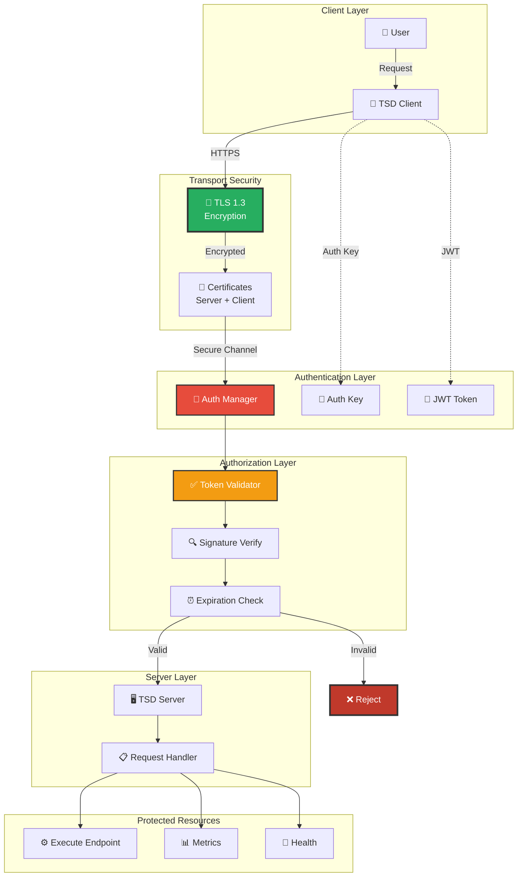
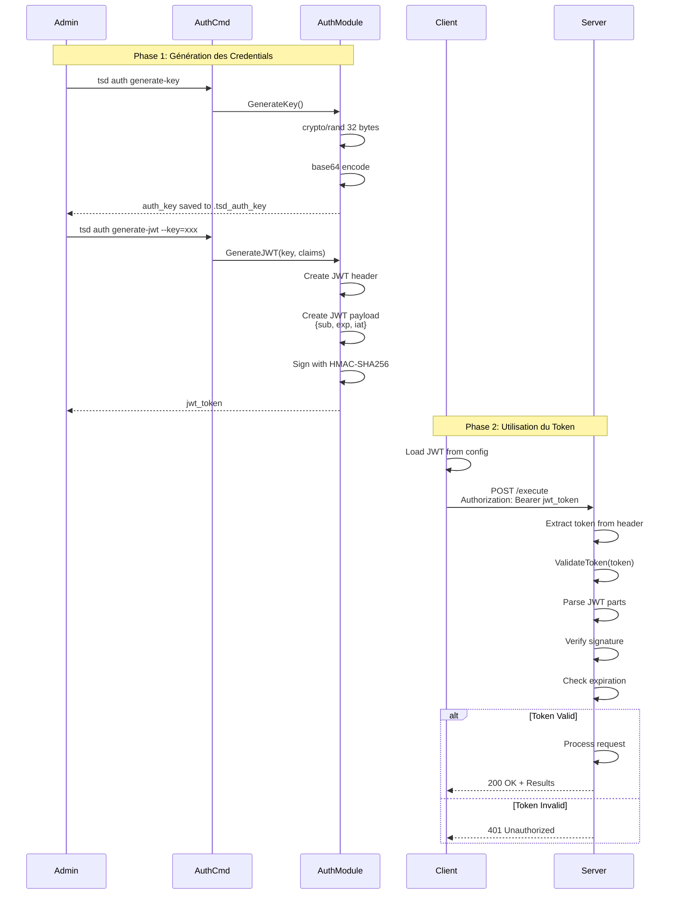
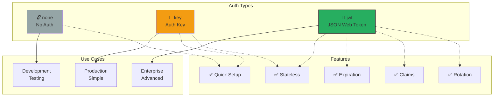
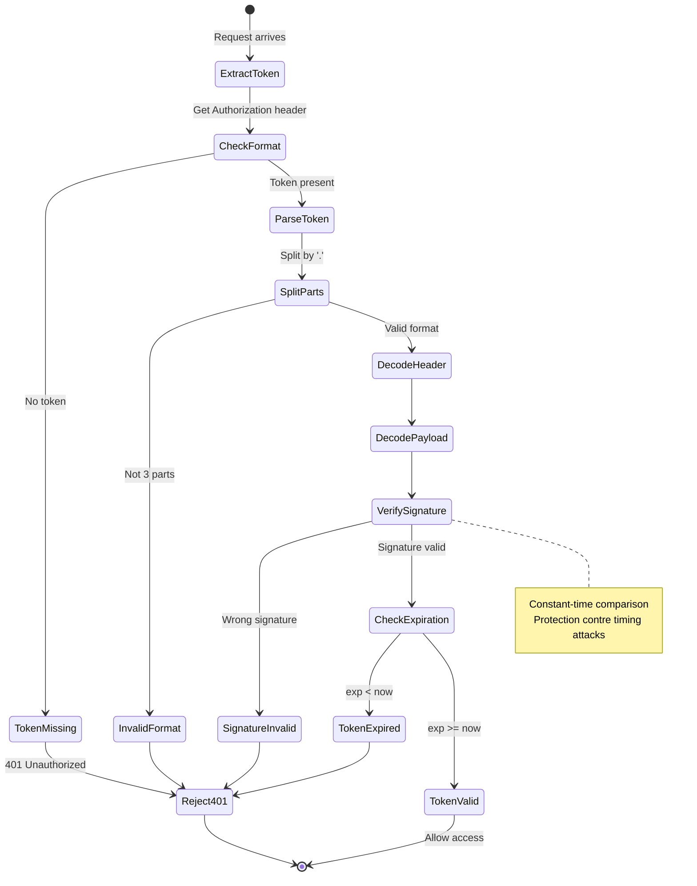
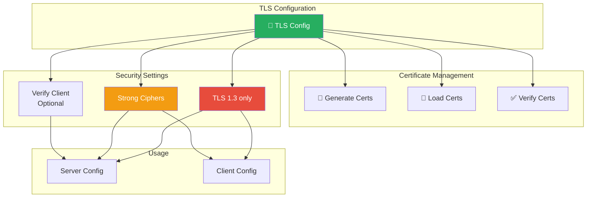
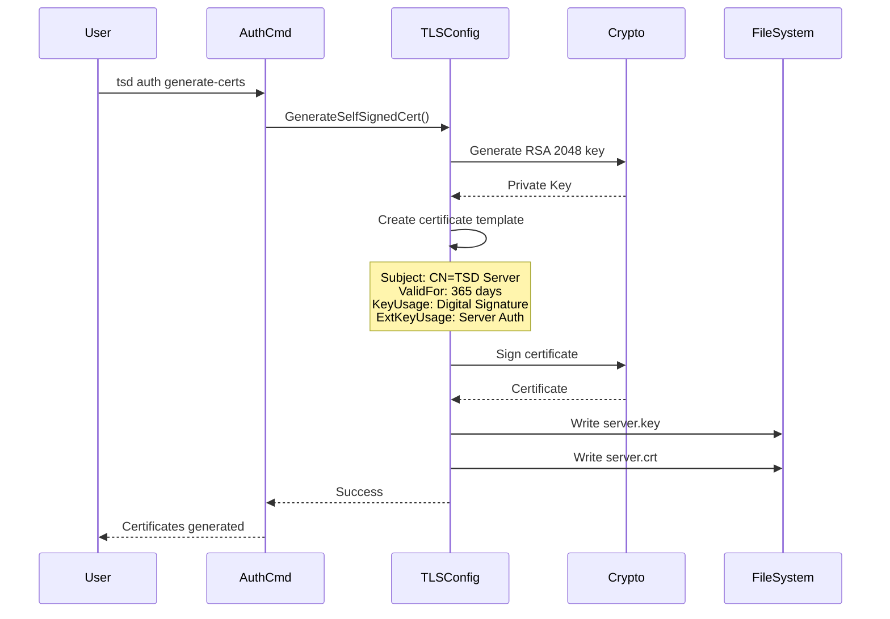
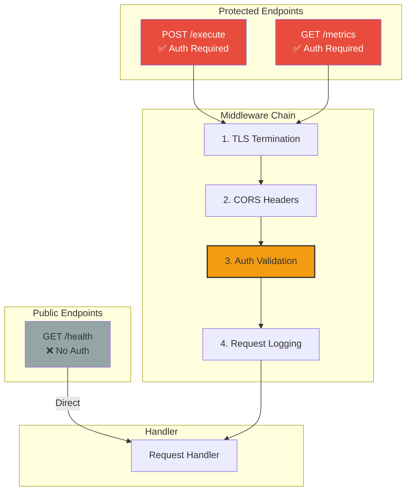
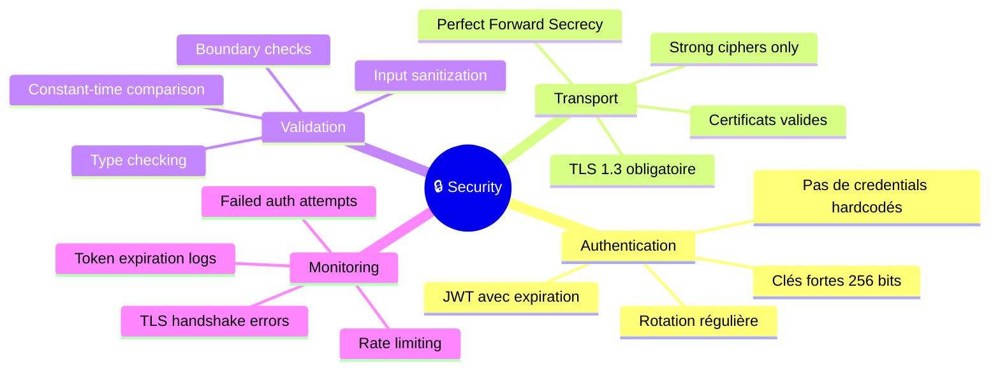
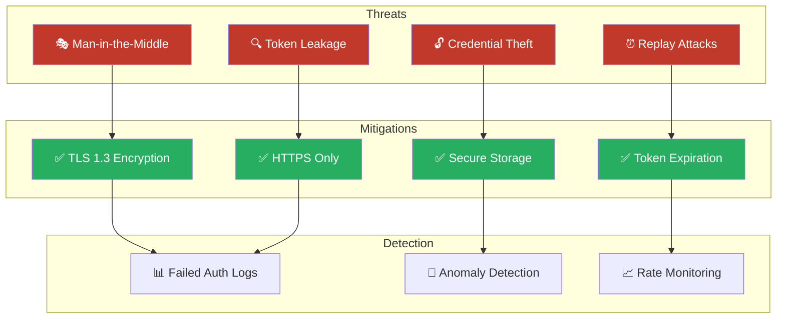
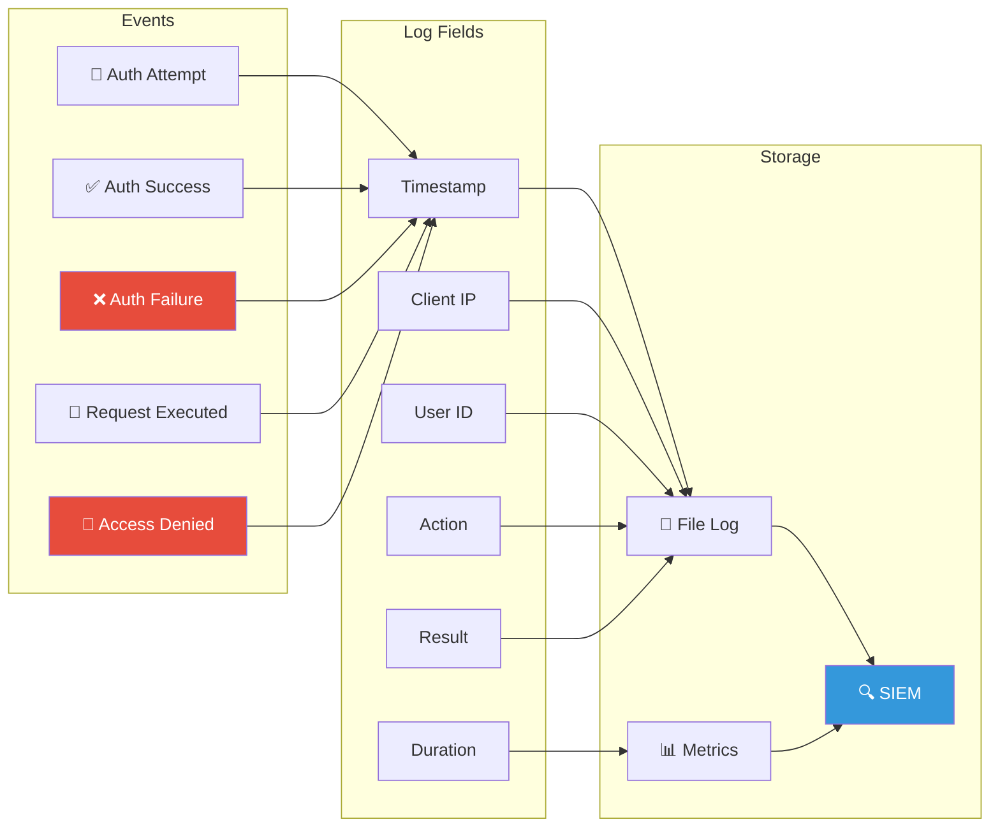

# 🔒 Sécurité et Authentification

**Date** : 2025-12-16  
**Version** : 1.0.0  
**Statut** : Documentation officielle

---

## Architecture Sécurité



---

## Flux d'Authentification JWT



---

## Types d'Authentification



---

## Structure JWT

```mermaid
graph LR
    subgraph "JWT Token Structure"
        HEADER[📋 Header<br/>{alg: HS256, typ: JWT}]
        PAYLOAD[📦 Payload<br/>{sub, exp, iat, custom}]
        SIGNATURE[✍️ Signature<br/>HMAC-SHA256]
    end

    subgraph "Encoding"
        B64H[Base64 Header]
        B64P[Base64 Payload]
        SIGN[HMAC Sign]
    end

    subgraph "Final Token"
        TOKEN[header.payload.signature]
    end

    HEADER --> B64H
    PAYLOAD --> B64P
    B64H --> SIGN
    B64P --> SIGN
    SIGN --> SIGNATURE
    
    B64H --> TOKEN
    B64P --> TOKEN
    SIGNATURE --> TOKEN

    style HEADER fill:#E8F4F8
    style PAYLOAD fill:#FFE5CC
    style SIGNATURE fill:#D5F4E6
    style TOKEN fill:#C3F0CA,stroke:#333,stroke-width:2px
```

**Exemple de JWT :**
```
eyJhbGciOiJIUzI1NiIsInR5cCI6IkpXVCJ9.
eyJzdWIiOiJ1c2VyMTIzIiwiZXhwIjoxNzM0MzYwMDAwLCJpYXQiOjE3MzQzNTY0MDB9.
7xKw9Y2Vp8qN3mF5tR1sL9jH4aU6bD8eK0vC2wX3gT5
```

---

## Validation de Token



---

## Configuration TLS



**Configuration par défaut :**
```go
MinVersion: tls.VersionTLS13
CipherSuites: [
    TLS_AES_128_GCM_SHA256
    TLS_AES_256_GCM_SHA384
    TLS_CHACHA20_POLY1305_SHA256
]
```

---

## Génération de Certificats



---

## Endpoints Sécurisés



---

## Bonnes Pratiques Sécurité



---

## Threat Model



---

## Configuration Serveur Sécurisé

```yaml
# Exemple de configuration serveur TSD
server:
  address: "0.0.0.0:8443"
  
  tls:
    enabled: true
    cert_file: "certs/server.crt"
    key_file: "certs/server.key"
    min_version: "TLS13"
    
  auth:
    type: "jwt"
    secret_file: ".tsd_auth_key"
    
  timeouts:
    read: 15s
    write: 15s
    idle: 60s
    
  rate_limit:
    requests_per_second: 100
    burst: 200
```

---

## Audit Log



---

## Références

- [Architecture Globale](01-global-architecture.md)
- [Module Auth](../../auth/)
- [Module TLS Config](../../internal/tlsconfig/)
- [Documentation Sécurité](../../SECURITY.md)

---

**Maintenu par** : TSD Contributors  
**Dernière mise à jour** : 2025-12-16
