# 📊 Modèle de Données TSD

**Date** : 2025-12-16  
**Version** : 1.0.0  
**Statut** : Documentation officielle

---

## Vue d'Ensemble du Modèle de Données

```mermaid
classDiagram
    class Program {
        +TypeDefinitions []TypeDef
        +Rules []Rule
        +Facts []Fact
        +GetType(name) TypeDef
        +GetRule(id) Rule
    }

    class TypeDef {
        +Name string
        +Fields []Field
        +Validate(fact) error
    }

    class Field {
        +Name string
        +Type FieldType
        +Required bool
    }

    class Rule {
        +ID string
        +Variables []Variable
        +Conditions []Condition
        +Actions []Action
    }

    class Fact {
        +Type string
        +ID string
        +Fields map[string]interface{}
        +GetValue(path) interface{}
    }

    class Condition {
        +Left Expression
        +Operator string
        +Right Expression
        +Evaluate(context) bool
    }

    class Action {
        +Type ActionType
        +Predicate string
        +Arguments []Expression
        +Execute(context) error
    }

    Program --> TypeDef
    Program --> Rule
    Program --> Fact
    TypeDef --> Field
    Rule --> Condition
    Rule --> Action
    Fact --> TypeDef
```

---

## Hiérarchie des Types


---

## Définition de Type

```mermaid
graph LR
    subgraph "Type Definition"
        TYPE[type Person]
    end

    subgraph "Fields"
        F1[id: string]
        F2[name: string]
        F3[age: int]
        F4[email: string]
        F5[active: bool]
    end

    subgraph "Constraints"
        C1[id: required]
        C2[age: >= 0]
        C3[email: format]
    end

    subgraph "Instance"
        FACT[Person<br/>{id:1, name:John,<br/>age:25, email:...,<br/>active:true}]
    end

    TYPE --> F1
    TYPE --> F2
    TYPE --> F3
    TYPE --> F4
    TYPE --> F5
    
    F1 -.-> C1
    F3 -.-> C2
    F4 -.-> C3
    
    C1 --> FACT
    C2 --> FACT
    C3 --> FACT

    style TYPE fill:#4A90E2,color:#fff
    style FACT fill:#D5F4E6,stroke:#333,stroke-width:2px
```

---

## Structure d'une Règle

```mermaid
graph TB
    subgraph "Rule Structure"
        RULE[rule r1]
    end

    subgraph "Variables Declaration"
        VAR[{p: Person, o: Order}]
    end

    subgraph "Conditions"
        C1[p.age >= 18]
        C2[o.amount > 100]
        C3[p.id == o.customer_id]
        
        C1 --> AND1[AND]
        C2 --> AND1
        AND1 --> AND2[AND]
        C3 --> AND2
    end

    subgraph "Aggregations"
        AGG[SUM o.amount >= 1000]
    end

    subgraph "Actions"
        A1[premium_customer]
        A2[send_notification]
    end

    RULE --> VAR
    VAR --> C1
    VAR --> C2
    VAR --> C3
    AND2 --> AGG
    AGG --> A1
    AGG --> A2

    style RULE fill:#4A90E2,color:#fff
    style AND1 fill:#F39C12
    style AND2 fill:#F39C12
    style AGG fill:#E74C3C,color:#fff
    style A1 fill:#27AE60,color:#fff
    style A2 fill:#27AE60,color:#fff
```

---

## Types d'Expressions

```mermaid
classDiagram
    class Expression {
        <<interface>>
        +Evaluate(context) Value
        +Type() ExprType
    }

    class LiteralExpr {
        +Value interface{}
        +Evaluate() Value
    }

    class VariableExpr {
        +Name string
        +Path []string
        +Evaluate(context) Value
    }

    class BinaryExpr {
        +Left Expression
        +Operator string
        +Right Expression
        +Evaluate(context) Value
    }

    class UnaryExpr {
        +Operator string
        +Operand Expression
        +Evaluate(context) Value
    }

    class FunctionExpr {
        +Name string
        +Arguments []Expression
        +Evaluate(context) Value
    }

    class AggregateExpr {
        +Function string
        +Source Pattern
        +Condition Condition
        +Field Expression
        +Evaluate(context) Value
    }

    Expression <|-- LiteralExpr
    Expression <|-- VariableExpr
    Expression <|-- BinaryExpr
    Expression <|-- UnaryExpr
    Expression <|-- FunctionExpr
    Expression <|-- AggregateExpr
    
    BinaryExpr --> Expression
    UnaryExpr --> Expression
    FunctionExpr --> Expression
```

---

## Opérateurs Supportés


---

## Fonctions Builtin


---

## Cycle de Vie d'un Fait

```mermaid
stateDiagram-v2
    [*] --> Created: Assert fact
    
    Created --> Validated: Type check
    Validated --> ValidationFailed: Invalid type/fields
    Validated --> Indexed: Valid
    
    ValidationFailed --> [*]: Error
    
    Indexed --> InMemory: Store in WorkingMemory
    InMemory --> AlphaEval: Propagate to Alpha Network
    
    AlphaEval --> NoMatch: No matching conditions
    AlphaEval --> AlphaMemory: Conditions matched
    
    NoMatch --> InMemory: Still available
    
    AlphaMemory --> BetaPropagation: Create tokens
    BetaPropagation --> JoinEvaluation
    JoinEvaluation --> Activation: Rule triggered
    
    Activation --> ActionExecution
    ActionExecution --> NewFacts: Generate new facts
    
    NewFacts --> Created: Recursive
    
    InMemory --> Retracted: Remove fact
    Retracted --> [*]

    note right of Indexed
        Faits indexés par type
        pour recherche efficace
    end note
    
    note right of AlphaMemory
        Tokens créés et stockés
        dans Alpha Memory
    end note
```



---

## Index et Recherche

```mermaid
graph TB
    subgraph "Working Memory"
        WM[Working Memory]
    end

    subgraph "Primary Index"
        PRI[Facts by ID<br/>map[string]*Fact]
    end

    subgraph "Type Index"
        TYP[Facts by Type<br/>map[string][]*Fact]
    end

    subgraph "Field Index"
        FLD[Facts by Field<br/>map[string]map[interface{}][]*Fact]
    end

    subgraph "Query Patterns"
        Q1[Get by ID: O1]
        Q2[Get all Orders]
        Q3[Get Orders with amount>100]
    end

    WM --> PRI
    WM --> TYP
    WM --> FLD
    
    Q1 --> PRI
    Q2 --> TYP
    Q3 --> FLD

    style WM fill:#4A90E2,color:#fff
    style PRI fill:#FFE5CC
    style TYP fill:#FFE5CC
    style FLD fill:#FFE5CC
    style Q1 fill:#D5F4E6
    style Q2 fill:#D5F4E6
    style Q3 fill:#D5F4E6
```

---

## Exemple Complet de Programme

```mermaid
graph TB
    subgraph "1. Type Definitions"
        T1[type Person {<br/>id: string<br/>name: string<br/>age: int<br/>}]
        T2[type Order {<br/>id: string<br/>customer_id: string<br/>amount: float<br/>}]
    end

    subgraph "2. Facts"
        F1[Person{id:p1, name:Alice, age:25}]
        F2[Person{id:p2, name:Bob, age:17}]
        F3[Order{id:o1, customer_id:p1, amount:150}]
        F4[Order{id:o2, customer_id:p1, amount:900}]
    end

    subgraph "3. Rules"
        R1[rule adult:<br/>{p: Person} / p.age >= 18<br/>==> adult]
        R2[rule vip:<br/>{p: Person} /<br/>SUM amount >= 1000<br/>==> vip]
    end

    subgraph "4. Execution"
        E1[Parse & Compile]
        E2[Assert Facts]
        E3[Propagate]
        E4[Evaluate]
    end

    subgraph "5. Results"
        RES1[adult<br/>✓ p1: Alice]
        RES2[vip<br/>✓ p1: Alice<br/>total: 1050]
    end

    T1 --> E1
    T2 --> E1
    R1 --> E1
    R2 --> E1
    
    F1 --> E2
    F2 --> E2
    F3 --> E2
    F4 --> E2
    
    E1 --> E3
    E2 --> E3
    E3 --> E4
    E4 --> RES1
    E4 --> RES2

    style T1 fill:#E8F4F8
    style T2 fill:#E8F4F8
    style F1 fill:#FFE5CC
    style F2 fill:#FFE5CC
    style F3 fill:#FFE5CC
    style F4 fill:#FFE5CC
    style R1 fill:#CCE5FF
    style R2 fill:#CCE5FF
    style RES1 fill:#D5F4E6,stroke:#333,stroke-width:2px
    style RES2 fill:#D5F4E6,stroke:#333,stroke-width:2px
```

---

## Transformation de Données


---

## Contraintes et Validations


---

## Références

- [Architecture Globale](01-global-architecture.md)
- [RETE Engine](03-rete-architecture.md)
- [Documentation Langage](../../reference.md)

---

**Maintenu par** : TSD Contributors  
**Dernière mise à jour** : 2025-12-16
