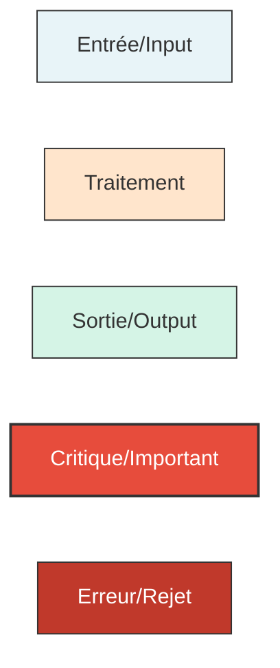

# 📊 Diagrammes d'Architecture TSD

**Date** : 2025-12-16  
**Version** : 1.0.0  
**Statut** : Documentation officielle

---

## 📋 Vue d'Ensemble

Ce répertoire contient l'ensemble des diagrammes visuels illustrant l'architecture du système TSD. Ces diagrammes utilisent principalement Mermaid (intégré dans Markdown) pour faciliter la maintenance et la génération.

---

## 📚 Table des Diagrammes

### 1. Architecture Globale
📄 **Fichier** : [01-global-architecture.md](01-global-architecture.md)

**Contenu** :
- Vue d'ensemble du système avec tous les modules
- Architecture en couches (Entry Point → Commands → Core → Storage)
- Graphe de dépendances (DAG)
- Description détaillée de chaque module
- Métriques architecture

**Pour qui ?** : Nouveaux contributeurs, architectes, revue globale

---

### 2. Flux de Données
📄 **Fichier** : [02-data-flow.md](02-data-flow.md)

**Contenu** :
- Flux d'exécution locale (CLI → Parser → RETE)
- Flux client-serveur HTTPS
- Propagation des tokens RETE (Alpha → Beta → Terminal)
- Cycle de vie d'une règle
- Pipeline de compilation
- Flux de génération d'authentification
- Gestion de la mémoire RETE
- Performances et optimisations

**Pour qui ?** : Développeurs comprenant les flux de données, debugging

---

### 3. Architecture Moteur RETE
📄 **Fichier** : [03-rete-architecture.md](03-rete-architecture.md)

**Contenu** :
- Vue d'ensemble du moteur RETE
- Types de nœuds (Alpha, Beta, Join, Aggregate, NOT, Terminal)
- Réseau Alpha (filtrage)
- Réseau Beta (jointures)
- Nœuds d'agrégation
- Nœuds NOT (négation)
- Optimisations Alpha/Beta Sharing
- Architecture complète d'une règle
- Structures de données clés

**Pour qui ?** : Développeurs RETE, optimisation performance

---

### 4. Sécurité et Authentification
📄 **Fichier** : [04-security-flow.md](04-security-flow.md)

**Contenu** :
- Architecture sécurité globale
- Flux d'authentification JWT
- Types d'authentification (none, key, jwt)
- Structure JWT
- Validation de token
- Configuration TLS
- Génération de certificats
- Endpoints sécurisés
- Threat model et mitigations
- Audit log

**Pour qui ?** : Équipe sécurité, DevOps, audit

---

### 5. Modèle de Données
📄 **Fichier** : [05-data-model.md](05-data-model.md)

**Contenu** :
- Vue d'ensemble du modèle de données
- Hiérarchie des types
- Définition de type et contraintes
- Structure d'une règle
- Types d'expressions
- Opérateurs supportés
- Fonctions builtin
- Cycle de vie d'un fait
- Index et recherche
- Transformations de données
- Contraintes et validations

**Pour qui ?** : Développeurs utilisant l'API, rédacteurs de règles

---

## 🎯 Guide d'Utilisation

### Par Rôle

| Rôle | Diagrammes Recommandés |
|------|------------------------|
| **Nouveau Contributeur** | 01 → 02 → 05 |
| **Développeur Backend** | 01 → 02 → 03 |
| **Développeur RETE** | 03 → 02 |
| **DevOps / SRE** | 01 → 04 |
| **Architecte** | 01 → 02 → 03 → 04 |
| **Auditeur Sécurité** | 04 |
| **Utilisateur API** | 05 → 02 |

### Par Objectif

| Objectif | Diagrammes |
|----------|-----------|
| **Comprendre l'architecture** | 01 |
| **Débugger un problème** | 02, 03 |
| **Optimiser les performances** | 03, 02 |
| **Audit de sécurité** | 04 |
| **Écrire des règles** | 05 |
| **Intégration client** | 02, 04, 05 |

---

## 🛠️ Technologies Utilisées

### Mermaid
Tous les diagrammes utilisent **Mermaid.js** intégré dans les fichiers Markdown.

**Avantages** :
- ✅ Versionnement avec Git
- ✅ Génération automatique
- ✅ Rendu dans GitHub/GitLab
- ✅ Maintenance facile (texte)
- ✅ Pas d'outils externes

**Visualisation** :
- GitHub : Rendu natif des diagrammes Mermaid
- VS Code : Extension "Markdown Preview Mermaid Support"
- En ligne : [Mermaid Live Editor](https://mermaid.live/)

### Types de Diagrammes Utilisés

| Type Mermaid | Usage |
|--------------|-------|
| `graph TB/LR` | Diagrammes de flux, architecture |
| `sequenceDiagram` | Séquences d'interactions |
| `classDiagram` | Modèles de données, classes |
| `stateDiagram-v2` | Machines à états, cycles de vie |
| `mindmap` | Arborescences conceptuelles |

---

## 📝 Conventions de Style

### Codes Couleurs

### Emojis Utilisés

| Emoji | Signification |
|-------|---------------|
| 🎯 | Point d'entrée, focus principal |
| 🧠 | Logique métier, algorithme |
| 🔐 | Sécurité, authentification |
| 💾 | Stockage, persistance |
| 🔍 | Filtrage, recherche |
| 🔗 | Jointure, liaison |
| 🧮 | Agrégation, calcul |
| ✅ | Validation, succès |
| ❌ | Rejet, échec |
| ⚡ | Performance, cache |
| 📡 | Communication réseau |
| 📊 | Métriques, monitoring |

---

## 🔄 Maintenance des Diagrammes

### Quand Mettre à Jour ?

- ✅ Ajout d'un nouveau module
- ✅ Changement architectural significatif
- ✅ Modification des flux de données
- ✅ Nouvelle fonctionnalité de sécurité
- ✅ Changement du modèle de données

### Process de Mise à Jour

1. **Identifier** le(s) diagramme(s) impacté(s)
2. **Modifier** le code Mermaid dans le Markdown
3. **Valider** le rendu (VS Code ou Mermaid Live)
4. **Tester** les liens entre documents
5. **Commit** avec message descriptif
6. **Update** la date "Dernière mise à jour"

### Checklist Validation

- [ ] Diagramme s'affiche correctement dans GitHub
- [ ] Tous les liens fonctionnent
- [ ] Cohérence avec les autres diagrammes
- [ ] Documentation textuelle à jour
- [ ] Date de mise à jour modifiée

---

## 📖 Ressources Complémentaires

### Documentation TSD
- [Architecture Détaillée](../architecture.md)
- [Vue d'Ensemble Système](../SYSTEM_OVERVIEW.md)
- [Guide API](../api.md)
- [Documentation Configuration](../configuration.md)

### Documentation Externe
- [Mermaid Documentation](https://mermaid.js.org/)
- [GitHub Mermaid Support](https://docs.github.com/en/get-started/writing-on-github/working-with-advanced-formatting/creating-diagrams)
- [RETE Algorithm Paper](https://cis.temple.edu/~giorgio/cis587/readings/rete.html)

---

## 💡 Bonnes Pratiques

### Conception de Diagrammes

1. **Simplicité** : Un diagramme = un concept
2. **Clarté** : Labels explicites, pas d'ambiguïté
3. **Cohérence** : Mêmes conventions dans tous les diagrammes
4. **Navigation** : Liens entre diagrammes connexes
5. **Contexte** : Description textuelle autour du diagramme

### Éviter

- ❌ Diagrammes trop complexes (>20 nœuds)
- ❌ Trop de détails techniques
- ❌ Informations redondantes
- ❌ Diagrammes obsolètes
- ❌ Manque de légende/explication

---

## 🤝 Contribution

Pour ajouter ou modifier un diagramme :

1. **Lire** ce README pour comprendre les conventions
2. **Choisir** le type de diagramme approprié
3. **Créer/Modifier** le fichier Markdown avec Mermaid
4. **Valider** le rendu
5. **Ajouter** une entrée dans ce README
6. **Soumettre** une Pull Request

---

## 📊 Statistiques

| Métrique | Valeur |
|----------|--------|
| **Nombre de diagrammes** | 5 documents |
| **Types de diagrammes** | 15+ diagrammes Mermaid |
| **Lignes de documentation** | ~1500 lignes |
| **Dernière révision complète** | 2025-12-16 |

---

**Maintenu par** : TSD Contributors  
**Dernière mise à jour** : 2025-12-16
